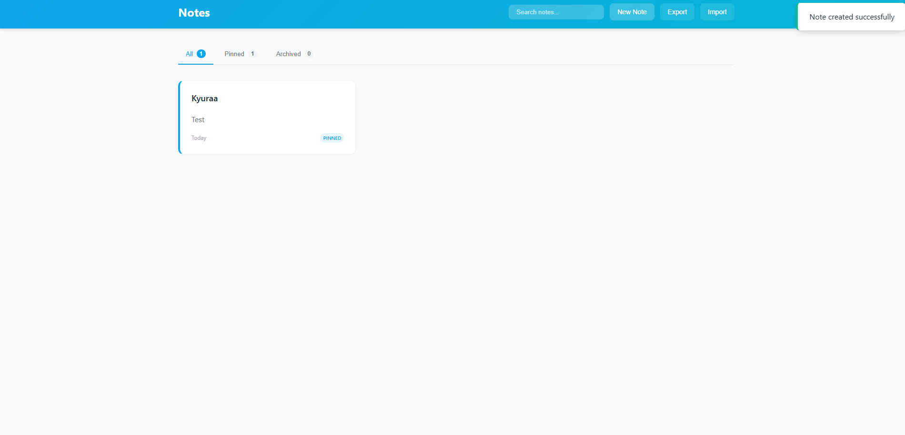

# 📝 Kyura Project #1 — Note App  

  
  


---

## 📖 About  

**Note App** is a simple and lightweight note-taking application built with **HTML, CSS, and JavaScript**.  
This project is part of **Kyura Project #1 (KP #1)**, created to practice and improve front-end web development skills.  

---

## 🚀 Features  

- ✏️ Add new notes  
- 🗑️ Delete notes  
- 💾 Auto-save using **localStorage** (your notes remain after closing the browser)  
- 🎨 Clean, simple, and responsive design  

---

## 🖼️ Demo Preview  

  


## ⚙️ Installation & Usage  

1. **Clone this repository**  
   ```bash
   git clone https://github.com/KyuraCodes/Kyura-Project-1-Note-App.git
   ```


2. **Navigate into the project folder**

   ```bash
   cd Kyura-Project-1-Note-App
   ```

3. **Run the app**
   Just open `index.html` in your browser ✨

---

## 📌 Roadmap / Future Improvements

* 🔒 Edit note feature
* 🌙 Dark/Light mode toggle
* ☁️ Cloud storage support (Supabase / Firebase)

---

## 👤 Author

**Kyura** — Beginner Web Developer

> Part of the **Kyura Project (KP)** series.
> Follow for more projects & improvements! 🚀

---

## 📝 License

This project is licensed under the **MIT License** — feel free to use, modify, and share.

